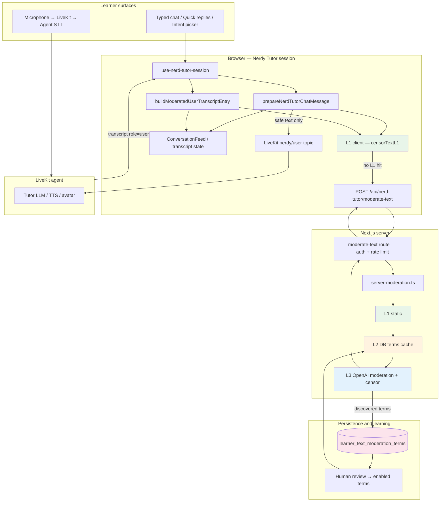
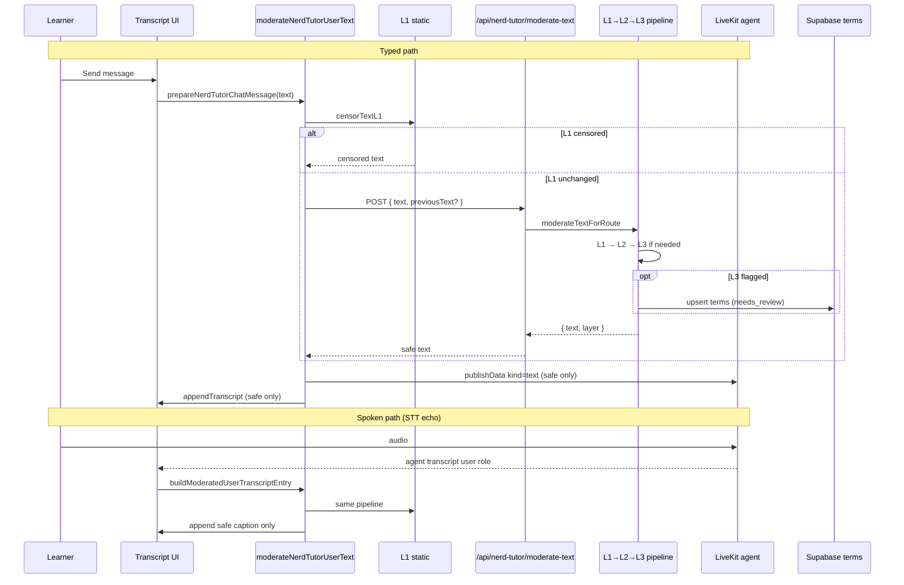
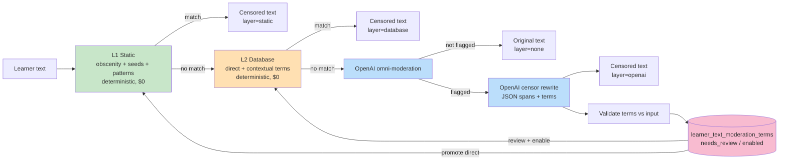
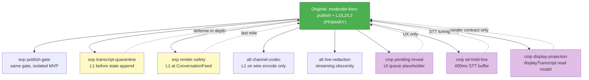

# Nerdy Tutor Text Moderation — Architecture Diagrams

Visual reference for the production moderation stack in
`student-onboarding-orchestration` (`lib/profanity`, Nerdy Tutor session hook).

**Companion (plain text for Google Docs):**
`../../vt-onboarding/nerdy-moderation-original-vs-cmp-google-docs.txt`

**Export PNG/SVG:** copy any Mermaid block into [mermaid.live](https://mermaid.live) → Actions → Export.

---

## 1. System overview

---

## 2. Primary rule — moderate-then-publish (original branch)

Branch: `vt4s-10659-nerdy-tutor-moderation`

---

## 3. Server pipeline — deterministic layers, OpenAI, feedback loop

**L1/L2:** every hit avoids OpenAI moderation + rewrite → lower cost and latency.

**Multilingual:** L3 flags any language; validated terms land in the DB (`normalized_term`, `language_code`); after review, L2 blocks locally without another OpenAI call.

---

## 4. Experiment branches (optional layers on top of the original)

---

## Legend

| Color / layer | Meaning |
|---------------|---------|
| Green (L1) | Static, local, deterministic |
| Orange (L2) | Database — learned, reviewed terms |
| Blue (L3) | OpenAI moderation + rewrite |
| Pink (DB) | Multilingual learning loop |

## Key files

| Path | Role |
|------|------|
| `lib/profanity/static-moderation.ts` | L1 lexicon + normalization |
| `lib/profanity/server-moderation.ts` | L2/L3 server pipeline |
| `lib/profanity/client-moderation.ts` | Client L1 then API |
| `lib/nerd-tutor/text-moderation.ts` | Nerdy Tutor client wrapper + metrics |
| `lib/nerd-tutor/session/chat-message-moderation.ts` | Typed pre-publish gate |
| `lib/nerd-tutor/session/user-transcript-moderation.ts` | STT echo ingress gate |
| `app/(app)/api/nerd-tutor/moderate-text/route.ts` | Authenticated API entry |
