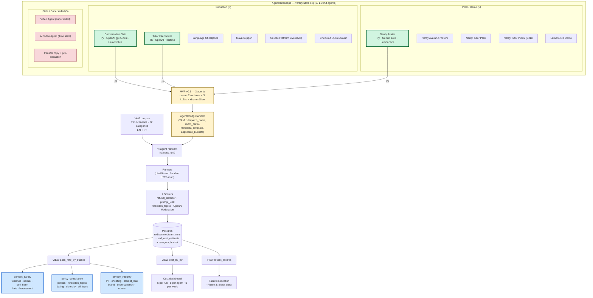
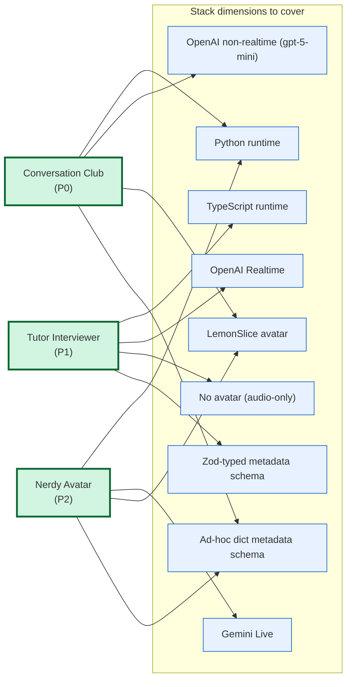

# LiveKit Agent Coverage Matrix

Discovery output: every LiveKit-hosted agent in the `varsitytutors` org
as of mid-2026, with explicit MVP scope prioritization.

## Diagram 1 — End-to-end pipeline (16 agents → MVP → harness → exec buckets)

Export PNG via [mermaid.live](https://mermaid.live) (Actions → Export).



## Diagram 2 — Why these 3 (stack-coverage rationale)

Each cell shows whether the candidate agent **exercises** the stack
dimension. The 3 MVP agents (Conversation Club + Tutor Interviewer +
Nerdy Avatar) together cover **every dimension**, leaving no blind spot.



**Read it as**: P0 (Conversation Club) covers 4 dimensions →
P1 (Interviewer) adds 4 more orthogonal dimensions →
P2 (Nerdy Avatar) adds the remaining Gemini-stack coverage. The other
3 production agents (Maya, Course Platform, Checkout Quote) would not
add stack-coverage that these 3 don't already exercise — they enter in
Phase 2 onboarding, not Phase 1 risk-reduction.

---


## All identified agents (16)

| # | Agent | Repo | Lang | Dispatch name | Room prefix | Stack | Status |
|---|---|---|---|---|---|---|---|
| 1 | Tutor Interviewer | `varsitytutors/livekit-agents` | TS | `interview-agent` | `interview-*` | OpenAI Realtime, no avatar | **Prod** |
| 2 | Language Tutor (Conversation Club) | `varsitytutors/conversation-club` | Py | `language-tutor` | `language-tutor-*` | OpenAI gpt-5-mini + Gladia STT + ElevenLabs TTS + **LemonSlice** | **Prod** |
| 3 | Language Checkpoint examiner | `varsitytutors/conversation-club` | Py | `language-checkpoint` | `language-tutor-*` | Same as #2 | **Prod** |
| 4 | Maya Support Agent | `varsitytutors/student-onboarding-orchestration` | Py | `support-agent-maya` | `support-*` | OpenAI Realtime, no avatar | **Prod** |
| 5 | Course Platform Live (B2B) | `varsitytutors/b2b-course-platform` | Py | `course-platform-live-agent` | `course:*:*` | LiveKit `inference` + ai_coustics denoise + Silero VAD | **Prod-ish** |
| 6 | Checkout Quote Avatar | `varsitytutors/livekit-lemonslice-avatar-quotes` | Py | `lemonslice-avatar-agent` | `checkout-*` | OpenAI + Deepgram STT + ElevenLabs TTS + LemonSlice | **Prod** |
| 7 | Nerdy Avatar Tutor (Gemini POC) | `varsitytutors/nerdy-avatar` | Py | `nerdy-tutor` | `tutor-*` | **Gemini 3.1 Flash Live** + LemonSlice | POC (leadership demo) |
| 8 | Nerdy Avatar JPW fork | `varsitytutors/nerdy-avatar-jpw` | Py | `nerdy-tutor` | `tutor-*` | Same as #7 | Active POC fork |
| 9 | Nerdy Tutor POC | `varsitytutors/nerdy-tutor-poc` | Py | env `LIVEKIT_AGENT_NAME` (`test`) | `tutor-*` | Same Gemini + LemonSlice | POC (stale) |
| 10 | Nerdy Tutor POC2 (B2B) | `varsitytutors/nerdy-tutor-poc2` | Py | env (`test`) | `tutor-*` | Same | POC |
| 11 | Checkout Video Agent (redesign) | `varsitytutors/redesign-avatars-quotes-checkouts` | Py | `checkout-video-agent` | `checkout-*` | OpenAI + LemonSlice | Active branch |
| 12 | Checkout Video Agent (transfer copy) | `varsitytutors/temporary-quote-avatar-transfer` | Py | `checkout-video-agent` | `checkout-*` | Same | Transitional |
| 13 | Cloud Avatar Video Agent | `varsitytutors/video-agent` | Py | `cloud-agent` | `checkout-*` | OpenAI + LemonSlice | **Superseded** by #11 |
| 14 | AI Video Agent (Groq Kimi POC) | `varsitytutors/ai-video-agent` | Py | (unconfirmed) | — | Groq Kimi-K2 + ElevenLabs + LemonSlice | **Abandoned** (4mo stale) |
| 15 | LemonSlice Demo Agent | `varsitytutors/lemonslice-demo-agent` | Py + TS | `language-tutor` | `language-tutor-*` | Demo copy of #2 | Demo only |
| 16 | `temp-practice-v2` Language Tutor | `varsitytutors/temp-practice-v2` | Py + TS | env | `language-tutor-*` | Same family as #2 | Scratch |

## Convergence and divergence

**Agreed contract** across all 16:

- Dispatched by string `agent_name` via `AgentDispatchClient.createDispatch(roomName, agentName, { metadata })`
- Read config from `ctx.room.metadata` (or `ctx.job.metadata`) parsed as JSON
- Expect orchestrator service to have created the room first

**Diverges sharply on**:

- **Metadata schema**: Zod snake_case (interviewer) vs. ~30 ad-hoc camelCase fields (Conversation Club) vs. minimal `sessionId/sessionMode` (checkout) vs. `courseId`-driven hydration (B2B)
- **Room naming**: `interview-*`, `tutor-*`, `language-tutor-*`, `course:*:*`, `checkout-*`, `support-*` — six families, no overlap
- **Language runtime**: 1 TypeScript (interviewer), all others Python
- **Mouth/LLM**: OpenAI Realtime / Gemini Live / OpenAI non-realtime + 3rd-party TTS
- **Avatar layer**: with or without LemonSlice

**Implication**: a manifest-based contract is non-optional. Inference
won't work. Each agent needs an `AgentConfig` entry providing
`metadata_template`, `room_name_prefix`, and `dispatch_name`.

## MVP scope (v0.1, 3 agents)

Cover **3 of the 6 production agents**. These maximize coverage of stack
diversity while staying within a 3-week sprint:

| Priority | Agent | Why |
| --- | --- | --- |
| **P0** | **Conversation Club** (`language-tutor`) | Python (same runtime as our package — no subprocess overhead). Already carries `content_policy` (= `CONTENT_MODERATION_PROMPT`) in room metadata. Active development. Most representative of the "Python + OpenAI + LemonSlice" pattern shared by half the agents. |
| **P1** | **Tutor Interviewer** | Different runtime (TS) — forces the package to generalize beyond Python. OpenAI Realtime stack. Already validated end-to-end (Option D proof). |
| **P2** | **Nerdy Avatar** (`nerdy-tutor`) | Different Mouth (Gemini Live, not OpenAI). Different avatar integration. Tests the package's multi-vendor robustness. |

**Coverage achieved with these 3**: 2 runtimes, 3 LLM backends, ±LemonSlice, both metadata schema styles (Zod vs ad-hoc dict).

## Out of MVP scope (deferred to v0.2+)

- **Maya Support Agent** — production but separate dispatch routing layer; add when MVP integration patterns stabilize.
- **Course Platform Live** — B2B-only, distinct courseId hydration path.
- **Checkout Quote Avatar** — distinct e-commerce funnel context.
- **All POCs (Nerdy Avatar variants, Nerdy Tutor POCs, LemonSlice Demo)** — pick up via convention once a POC graduates to production.
- **Stale / abandoned**: Video Agent, AI Video Agent, transfer copies, pre-extraction agents — explicit DO NOT TARGET.

## Manifest contract (v0.1)

Each MVP agent gets either a `.redteam/manifest.yaml` in its own repo
**or** an entry in the central `agents.yaml` of the `vt-agent-redteam`
package. Schema:

```yaml
name: language-tutor                     # human-readable
livekit_agent_name: language-tutor       # the dispatch string
room_name_prefix: language-tutor         # for unique room generation
language_runtime: python                 # python | typescript
mouth_model: openai-gpt-5-mini           # for cost estimation
avatar: lemonslice                       # lemonslice | none

metadata_template:
  # Anything the agent's metadata schema requires. Templated with
  # {{ }} placeholders the harness substitutes per-scenario.
  language: "{{ scenario.language }}"
  system_prompt: "{{ tutor_default_prompt }}"
  learner_id: "{{ synthetic_learner_uuid }}"
  # ... 30 more fields for Conversation Club

known_system_prompt_source: "<URL or file path>"   # for PromptLeakDetector

# Categories to run against this agent — lets some agents skip irrelevant ones
applicable_buckets:
  - content_safety
  - policy_compliance
  - privacy_integrity

# Cost / latency budget per scenario (informs runner timeouts)
scenario_budget:
  max_seconds: 90
  max_cost_usd: 0.05

# Where the agent's CI workflow lives — for the trigger integration
deploy_workflow_path: ".github/workflows/redteam.yml"
```

Agents 4-6 (Maya, Course Platform, Checkout) get manifests in v0.2 when
their owning teams onboard.

## Ownership and decision boundary

- **MVP ownership**: VT4S (reviewable per current decision).
- **Per-agent manifest authoring**: starts in the central registry; moves
  to each agent's repo as ownership stabilizes.
- **Decision point for re-review**: after first agent integration ships,
  measure (a) cost of onboarding agent N+1 in minutes, (b) ratio of
  manifest churn to scenario churn. If onboarding is < 30min, central
  registry is fine; if > 2h, push manifests to per-repo.
